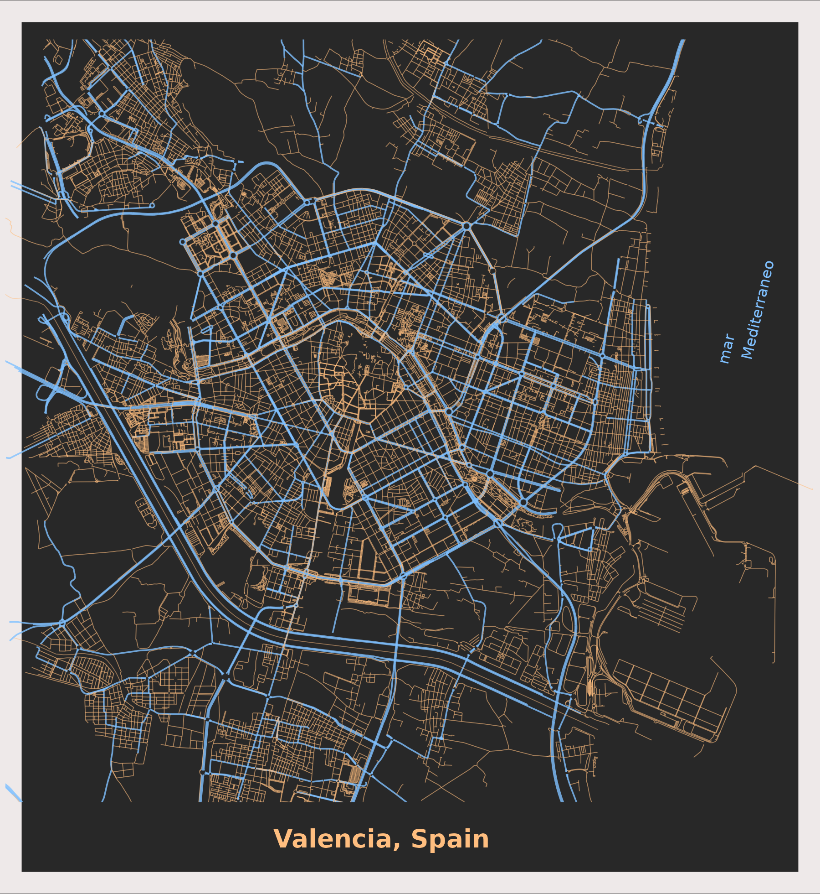

```{r setup, include=FALSE}
library(formatR)
knitr::opts_chunk$set(
  #code_folding = FALSE,
  echo = FALSE, warning = FALSE, message = FALSE,
  comment = "#>", results = "hold",
  collapse = TRUE,  fig.show = "hold", fig.asp = 0.618, fig.width = 6, out.width = "70%", fig.align = "center",
  R.options = list(width = 70) #- Keeping R code and output at 70 characters wide (or less) is recommended for readability on a variety of devices and screen sizes.
)
```

```{r options_setup, include = FALSE}
options(scipen = 999) #- para quitar la notación científica
```

```{r xaringanExtra-clipboard, include = FALSE}
htmltools::tagList(
  xaringanExtra::use_clipboard(
    button_text = "<i class=\"fa fa-clipboard\"></i>",
    success_text = "<i class=\"fa fa-check\" style=\"color: #90BE6D\"></i>",
  ),
  rmarkdown::html_dependency_font_awesome()
)
```

En el primer post del renacido blog **R & flowers** hago, siguiendo el código de <a href="https://ggplot2tutor.com/viz-pages/streetmaps/streetmaps/">este post</a>
   de  <a href="https://christianburkhart.de/">Christian Burkhart</a>, una visualización de las calles de Valencia: un streetmap.

## Intro/motivación

Resulta que el blog de al lado me está saliendo como muy serio, solo hago que procesar datos del INE y hacer algunas visualizaciones, pero muchas veces juego con R a replicar y modificar análisis que veo on the web, así que he decidido que algunos de estos "análisis" que hago los publicaré aquí. Si no los publico, muchas veces se acaban perdiendo, así que, vamos a ver si soy más organizado y guardo al menos algunos de ellos.

## aRt map de Valencia

Empiezo **R & flowers blog** replicando [este post](https://ggplot2tutor.com/viz-pages/streetmaps/streetmaps/) de [Christian Burkhart](https://christianburkhart.de/). Resulta que Christian tiene unos fantásticos tutoriales, generalmente sobre visualización [aquí](https://ggplot2tutor.com/) y topé de casualidad con unos gráficos/visualizaciones chulísimos que había hecho con las calles de su ciudad. Además Christian hacía disponible el código, gracias!!!,  así que aquí estoy replicando su análisis para hacer un streetmap de Valencia.

Su código ha funcionado sin problemas, solo he tenido que cambiar el nombre de la ciudad y sí que al final he añadido algunas lineas para tunear mi visualización, pero cosas menores


```{r, eval = FALSE, code_folding = "El código:", echo = TRUE}
#- Mapa con el callejero de una ciudad: https://ggplot2tutor.com/streetmaps/streetmaps/
#- https://ggplot2tutor.com/viz-pages/streetmaps/streetmaps/
library(tidyverse)
library(osmdata)
library(sf)

aa <- osmdata::available_features()        #- a list of all features
osmdata::available_tags("highway")   #- all tags of a feature via osmdata

osmdata::getbb("Valencia, Spain")  #- bbox ; he x-value indicates the longitude

my_city <- "Valencia, Spain"
streets <- getbb(my_city)%>% opq() %>%
            add_osm_feature(key = "highway", 
                value = c("motorway", "primary", "secondary", "tertiary")) %>% osmdata_sf()

#- small streets
small_streets <- getbb(my_city) %>% opq() %>% 
                 add_osm_feature(key = "highway", 
                  value = c("residential", "living_street", 
                            "unclassified", "service", "footway")) %>% osmdata_sf()
zz_4 <- small_streets[[4]]  
zz_5 <- small_streets[[5]]  
plot(zz_5, max.plot = 1)
zz_6 <- small_streets[[6]]  

river <- getbb(my_city) %>% opq() %>%
                add_osm_feature(key = "waterway", value = "river") %>%
                osmdata_sf()

zz_4 <- river[[4]]  #
zz_5 <- river[[5]]  
plot(zz_5, max.plot = 1)
zz_6 <- river[[6]]  #

#- plot inicial
ggplot() + geom_sf(data = streets$osm_lines, inherit.aes = FALSE, color = "black", size = .4, alpha = .8) +
           geom_sf(data = small_streets$osm_lines, inherit.aes = FALSE, color = "red", size = .3, alpha = .07) +                geom_sf(data = river$osm_lines,  inherit.aes = FALSE, color = "blue", size = .5, alpha = .5) + 
            coord_sf(xlim = c(-0.45, -0.27), ylim = c(39.27, 39.56), expand = FALSE) 


#- ya con un poco de color
ggplot() +
  geom_sf(data = streets$osm_lines,
          inherit.aes = FALSE,
          color = "steelblue",          size = .4,
          alpha = .8) +
  geom_sf(data = small_streets$osm_lines,
          inherit.aes = FALSE,
          color = "black",
          size = .4,
          alpha = .6) +
  geom_sf(data = river$osm_lines,
          inherit.aes = FALSE,
          color = "black",
          size = .2,
          alpha = .5) +
  coord_sf(xlim = c(-0.45, -0.27), ylim = c(39.27, 39.56), expand = FALSE) 


#- gráfico final ---------------------
library(ggfx)
library(ragg)
#- para guardar el plot me apoyé en:
#- https://github.com/gkaramanis/tidytuesday/tree/master/2021/2021-week8
agg_png("./aRt_map_valencia.png", res = 300, height = 8, width = 6, units = "in")
p <- ggplot() +
  geom_sf(data = streets$osm_lines,
          inherit.aes = FALSE, color = "#7fc0ff", 
          size = .4, alpha = .8) +
  geom_sf(data = small_streets$osm_lines,
          inherit.aes = FALSE, color = "#ffbe7f", 
          size = .2, alpha = .6) +
  geom_sf(data = river$osm_lines,
          inherit.aes = FALSE, color = "#ffbe7f", 
          size = .2, alpha = .5) +
  coord_sf(xlim = c(-0.44, -0.295), ylim = c(39.415, 39.52), expand = FALSE) +
  labs(title = "Valencia, Spain") +
  theme_void() +
  theme(plot.background = element_rect(fill = "#282828")  ) +
  theme(plot.title = element_text(face = "bold", 
        color = "#ffbe7f", hjust = 0.45, vjust = -161)) + 
  theme(plot.margin = unit(c(0.1, 0.05, 1.7, 0.1), "cm")) +
  theme(plot.background = element_rect(colour = "snow2", size = 10.7)) +
  geom_text(data = data.frame(x = -0.31, y = 39.475, 
        label = "mar \n  Mediterraneo"),
        mapping = aes(x = x, y = y, label = label),
        size = 2.82, angle = 77L, hjust = 0, vjust = 0.5, 
        colour = "#7fc0ff", inherit.aes = FALSE)

print(p)
dev.off()
knitr::plot_crop(here::here("imagenes", "aRt_map_valencia.png"))
```


El resultado:

```{r, echo = FALSE, layout = "l-body-outset"}

```

Fín