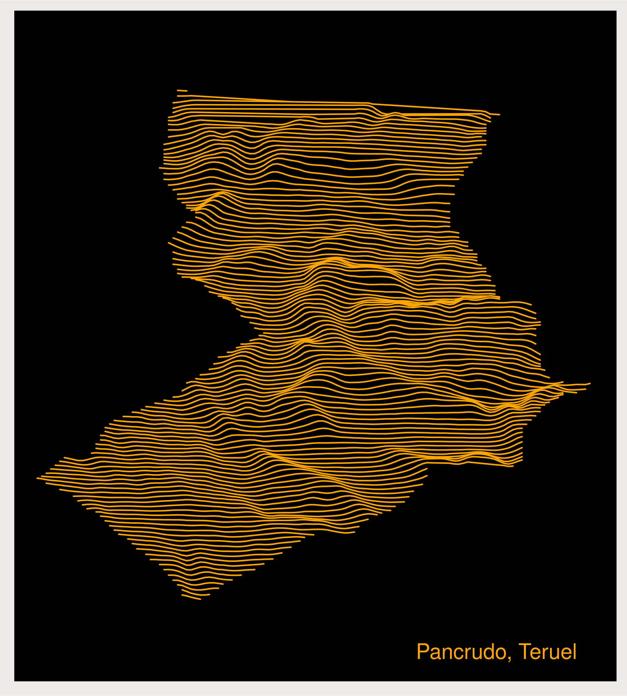

```{r setup, include=FALSE}
library(formatR)
knitr::opts_chunk$set(
  #code_folding = FALSE,
  echo = FALSE, warning = FALSE, message = FALSE,
  comment = "#>", results = "hold",
  collapse = TRUE,  fig.show = "hold", fig.asp = 0.618, fig.width = 6, out.width = "70%", fig.align = "center",
  R.options = list(width = 70) #- Keeping R code and output at 70 characters wide (or less) is recommended for readability on a variety of devices and screen sizes.
)
```

```{r options_setup, include = FALSE}
options(scipen = 999) #- para quitar la notación científica
```

```{r xaringanExtra-clipboard, include = FALSE}
htmltools::tagList(
  xaringanExtra::use_clipboard(
    button_text = "<i class=\"fa fa-clipboard\"></i>",
    success_text = "<i class=\"fa fa-check\" style=\"color: #90BE6D\"></i>",
  ),
  rmarkdown::html_dependency_font_awesome()
)
```

Al lío. Rápido-rápido. 

# Intro

Resulta que hace tiempo vi [este post](https://danielredondo.com/posts/20200125_joy_division/) de Daniel Redondo en el que se hacia un Joy Division plot con el relieve de la provincia de Granada. Cuando leí el post, intenté replicarlo, pero no pude/supe bajar los datos de altitud, así que lo deje, pero hace unos días vi el paquete [`elevatr`](https://github.com/jhollist/elevatr/) que hace que sea pan comido el bajar este tipo de datos. Así que ... a la segunda va la vencida. Seguro porque ya he hecho el plot.

Quien no sepa de que va el tema, puede echar un vistazo a este post sobre la portada de [Unknown Pleasures, el primer disco de Joy Division](https://codigoespagueti.com/noticias/ciencia/historia-secreta-unknown-pleasures/)


## Joy Division en Pancrudo, al menos su plot.

Para hacer el mapa se necesita el contorno, o geometría de Pancrudo y los datos de elevación. Ya los tengo del [anterior post](https://perezp44.github.io/pjperez.web/flowers/2021-04-10-mapa-con-elevacin-de-pancrudo/)


```{r, eval = FALSE, code_folding = "El código:", echo = TRUE}
#- hace falta tener la geometría, en este caso de Pancrudo
#- remotes::install_github("rOpenSpain/LAU2boundaries4spain")
municipios <- LAU2boundaries4spain::municipios_2021 
municipios <- pjpv.datos.01::LAU2_muni_2020_canarias
pancrudo_bound <- municipios %>% filter(ine_muni.n == "Pancrudo")

#- bajamos datos de elevación (Pancrudo) -----------------
elevation_data <- elevatr::get_elev_raster(locations = pancrudo_bound, z = 9, clip = "locations")
#- convertimos en data.frame y arreglamos
elevation_data <- as.data.frame(elevation_data, xy = TRUE)
colnames(elevation_data)[3] = "elevation"
#- quitamos NA's
elevation_data <- elevation_data[complete.cases(elevation_data),] 
```

Una vez tenemos los datos de elevación sólo hay que seguir al pie de la letra el [post de Daniel](https://danielredondo.com/posts/20200125_joy_division/). Muchas gracias Daniel!!

La primera aproximación no queda muy-muy chula, así que no la muestro.

```{r, eval = FALSE, code_folding = "El código:", echo = TRUE}
#- ahora el Joy Division plot: https://danielredondo.com/posts/20200125_joy_division/
library(ggplot2)
library(ggridges)
library(mapproj)

# Primera aproximación
ggplot(elevation_data, aes(x = x, y = y, group = y, height = elevation)) +
  geom_density_ridges(stat = "identity", scale = 70)
```

## Plot final de Daniel

<br>

Pero el final plot de Daniel es muy-muy chulo. Por decir que he cambiado algo, voy a hacerlo en verde.
😜


```{r, eval = FALSE, code_folding = "El código:", echo = TRUE}
#- final plot de Daniel
p <- ggplot(elevation_data, aes(x = x, y = y, group = y, height = elevation)) +
  geom_density_ridges(stat = "identity", scale = 30,
                      fill = "black", color = "green") +
  scale_x_continuous(name = NULL) +
  theme(panel.grid.major = element_blank(),
        panel.grid.minor = element_blank(),
        panel.background = element_rect(fill = "black"),
        axis.line = element_blank(),
        axis.text.x = element_blank(),
        plot.background = element_rect(fill = "black"),
        axis.ticks.x = element_blank(),
        axis.title.y = element_blank(),
        axis.text.y = element_blank(),
        axis.ticks.y = element_blank(),
        axis.title.x = element_text(colour = "white", size = 18)) +
  coord_map()
p

ggsave(p, filename = here::here("imagenes", "joy_division_Pancrudo_01.png"),
       device = "png", width = 12, height = 10, units = "cm")

```


```{r, echo = FALSE, out.width="90%"}
#- layout = "l-page"

```

## Y yo le pongo un marco

He intentado hacer alguna cosa más como poner alguna linea de otro color, situar a Pancrudo, pero todo muy rápido. Ya jugaré más con el plot algún día si me decido a hacer las camisetas. Creo que sí, mis hijos quieren una.

Al final me quedo con este plot:


```{r, echo = FALSE, out.width="120%"}
#- layout = "l-page"

```


Para acabar, el código todo junto:

```{r, eval = FALSE, code_folding = "El código:", echo = TRUE}
#- R script para hacer el flower post de 11 de Abril de 2021
#- voy a usar datos de elevación de aqui: https://rspatialdata.github.io/elevation.html

library(tidyverse)
library(raster)
library(elevatr)
library(sf)
library(viridis)

#library(rgeoboundaries) #- remotes::install_gitlab("dickoa/rgeoboundaries")
#swiss_bound <- geoboundaries("Switzerland")
#- aa <- rgeoboundaries::gb_adm0("Spain")

#- hace falta tener la geometría, en este caso de Pancrudo
#- remotes::install_github("rOpenSpain/LAU2boundaries4spain")
municipios <- LAU2boundaries4spain::municipios_2021 
municipios <- pjpv.datos.01::LAU2_muni_2020_canarias
pancrudo_bound <- municipios %>% filter(ine_muni.n == "Pancrudo")

#- bajamos datos de elevación (Pancrudo) -----------------
elevation_data <- elevatr::get_elev_raster(locations = pancrudo_bound, z = 9, clip = "locations")
#- convertimos en data.frame y arreglamos
elevation_data <- as.data.frame(elevation_data, xy = TRUE)
colnames(elevation_data)[3] = "elevation"
#- quitamos NA's
elevation_data <- elevation_data[complete.cases(elevation_data),] 

#- ahora el Joy Division plot: https://danielredondo.com/posts/20200125_joy_division/
library(ggplot2)
library(ggridges)
library(mapproj)

# Primera aproximación
p0 <- ggplot(elevation_data, aes(x = x, y = y, group = y, height = elevation)) +
  geom_density_ridges(stat = "identity", scale = 70)

ggsave(p0, filename = here::here("imagenes", "joy_division_Pancrudo_00.png"),
       device = "png", width = 10, height = 13, units = "cm")

#- grafico final de Daniel
p <- ggplot(elevation_data, aes(x = x, y = y, group = y, height = elevation)) +
  geom_density_ridges(stat = "identity", scale = 30,
                      fill = "black", color = "orange") +
  scale_x_continuous(name = NULL) +
  theme(panel.grid.major = element_blank(),
        panel.grid.minor = element_blank(),
        panel.background = element_rect(fill = "black"),
        axis.line = element_blank(),
        axis.text.x = element_blank(),
        plot.background = element_rect(fill = "black"),
        axis.ticks.x = element_blank(),
        axis.title.y = element_blank(),
        axis.text.y = element_blank(),
        axis.ticks.y = element_blank(),
        axis.title.x = element_text(colour = "white", size = 18)) +
  coord_map()
p

ggsave(p, filename = here::here("imagenes", "joy_division_Pancrudo_01.png"),
       device = "png", width = 12, height = 10, units = "cm")


#- intento hacer una linea en verde
elevation_verde <- elevation_data %>% filter(near(y, 40.79164, tol = 0.000081))
p + geom_density_ridges(data = elevation_verde, aes(x = x, y = y, group = y, height = elevation), stat = "identity", scale = 30, fill = "black", color = "white")


#- intento de ponerle un marco GOOD -------------------
#pancrudo_xx <- pancrudo_bound %>% sf::st_set_geometry(NULL)
p2 <- p + coord_sf(xlim = c(-1.095, -0.933), ylim = c(40.73, 40.91), expand = FALSE) +
  theme(plot.margin = unit(c(0.25, 0.25, 0.25, 0.25), "cm")) +
  #geom_point(data = pancrudo_bound, aes(x = X, y = Y), color = "white", fill = NA, shape = 15, size = 2) +
  theme(plot.background = element_rect(colour = "snow2", size = 10.7)) +
  geom_text(data = data.frame(x = -0.987, y = 40.736, label = "Pancrudo, Teruel"),
            mapping = aes(x = x, y = y, label = label),
            size = 5.2, hjust = 0, vjust = 0, 
            colour = "orange", inherit.aes = FALSE) 

p2

ggsave(p2, filename = here::here("imagenes", "joy_division_Pancrudo_02_naranja_x.png"),
       device = "png", width = 15, height = 20, units = "cm")
```

**FIN**

PD: Me quedo con las ganas de replicar otro post de Daniel, [este](https://danielredondo.com/posts/20180723_granada_hex/). De hecho lo he probado y salía, solo que a la hora de poner los hexstickers en los hexágonos me quedaba sin memoria, yo no, el PC. Tengo el código en el fichero `.R` del post anterior, el de el mapa con las elevaciones de Pancrudo (no à la Joy Division).

PD: Acabo de ver [este post](https://nils.ratnaweera.net/posts/2021-08-13-minimalistic-topography/)
