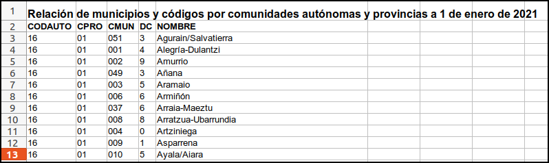
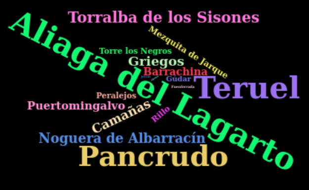
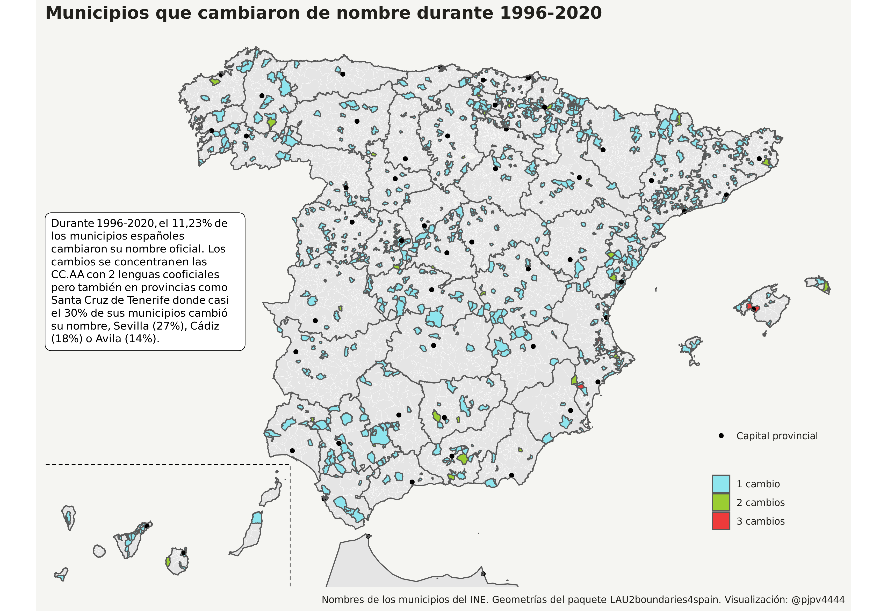

```{r setup, include=FALSE}
knitr::opts_chunk$set(
  #code_folding = FALSE,
  echo = FALSE, warning = FALSE, message = FALSE,
  comment = "#>",
  collapse = TRUE,  fig.show = "hold", fig.asp = 0.618, fig.width = 6, out.width = "70%", fig.align = "center",
  R.options = list(width = 60) #- Keeping R code and output at 70 characters wide (or less) is recommended for readability on a variety of devices and screen sizes.
)
```


```{r options_setup, include = FALSE}
options(scipen = 999) #- para quitar la notación científica
```


```{r xaringanExtra-clipboard, include = FALSE}
htmltools::tagList(
  xaringanExtra::use_clipboard(
    button_text = "<i class=\"fa fa-clipboard\"></i>",
    success_text = "<i class=\"fa fa-check\" style=\"color: #90BE6D\"></i>",
  ),
  rmarkdown::html_dependency_font_awesome()
)
```


Llevo unos meses en los que elijo un conjunto de datos del INE, los proceso y trato de hacer con ellos hacer algún análisis menor, generalmente satisfacer alguna curiosidad tonta o hacer un mapa, vamos de momento nada serio. Ya dije en [About](03_about.html) que esto me gusta, que me relaja, que es como hacer un sudoku.


Bueno, pues justo hoy, 9 de febrero, día en el que he creado este blog he visto un [tweet del INE](https://twitter.com/es_INE/status/1359080476003205121) anunciando que se ha publicado la relación de nombres de los municipios españoles y sus códigos a fecha 1 de enero de 2021. Así que ...

Además, hice algo sobre este tema [aquí](https://rflowers5.netlify.app/2018/01/20/municipios-espa%C3%B1oles-con-dos-nombres/) y [aquí](https://rflowers5.netlify.app/2018/01/21/mapas-de-municipios-espa%C3%B1oles-con-dos-nombres/). Concretamente intenté ver cuantos municipios españoles tenían dos nombres.


## Introducción

¿Hay que publicar cada año los nombres de los municipios? ¿Es que los nombres de los municipios cambian? Sí claro, algunos de ellos cambian su nombre. Por ejemplo, [aquí](https://www.ine.es/daco/daco42/codmun/codmun20/20codmunmod.htm) tienes la relación de alteraciones municipales ocurridas durante 2020. También hay años en que algunos municipios desaparecen porque se fusionan con otros y otros que aparecen porque se segregan. 

Tal como señala el INE [aquí](https://www.ine.es/dyngs/INEbase/es/operacion.htm?c=Estadistica_C&cid=1254736177031&menu=ultiDatos&idp=1254734710990), la relación de municipios es gestionada por el [Registro de Entidades Locales](https://www.mptfp.gob.es/portal/politica-territorial/local/sistema_de_informacion_local_-SIL-/registro_eell.html), pero el INE es el encargado de asignarles un código. El código de municipio se compone de cinco dígitos: los dos primeros corresponden al código de la provincia y los tres restantes al del municipio dentro de ésta.

En realidad, a nivel estadístico, el nombre de los municipios no es que sea muy relevante^[Bueno no es para nada relevante pero, para los habitantes del municipio el nombre de este sí es importante `r emo::ji("+1")`], pero tengo un blog que nutrir, así que voy a descargar y arreglar, si hiciera falta, el fichero con los nombres de los municipios para 2021. 


## Descarga de datos

El fichero completo se puede descargar en [esta dirección](https://www.ine.es/daco/daco42/codmun/diccionario21.xlsx). Cuando pasé el tiempo y estemos en 2022, imagino que esta relación se podrá descargar [aquí](https://www.ine.es/dyngs/INEbase/es/operacion.htm?c=Estadistica_C&cid=1254736177031&menu=ultiDatos&idp=1254734710990), concretamente en el epígrafe `Relación de años anteriores`.

Los datos se descargan en un fichero llamado `diccionario21.xlsx`. Dentro del fichero encontramos justo la relación de municipios, junto con algunos códigos. 


```{r, layout="l-body", echo = FALSE, out.width = "93%",  fig.height= 7, code_folding = FALSE}

```
 
Todo parece que está bastante bien, no parece que haya que arreglar nada, pero ... al menos para poder utilizar estos datos en mi "workflow" y poder fusionarlos con otros conjuntos de datos, tengo que crear el código municipal a 5 dígitos y ponereles el nombre que yo utilizo. Vamos a ello.

## Procesado de datos

En un conjunto de datos tan simple que hay poco que hacer pero aún así voy a :

- descargar los datos de la web del INE

- crear el código INE a 5 dígitos para municipios

- borrar lo que no necesito, por ejemplo el código de las CC.AA y el dígito de control

Con este primer chunk descargo los datos en una carpeta temporal y los arreglo

```{r, code_folding = TRUE}
#- descargo los datos 
url_descarga <- "https://www.ine.es/daco/daco42/codmun/diccionario21.xlsx"
nombre_fichero <- "diccionario21.xlsx"
fs::dir_create("tmp")       #- creo directorio temporal
my_ruta <- paste0("./tmp/", nombre_fichero) 
curl::curl_download(url = url_descarga, destfile = my_ruta) #- descargo fichero
df <- readxl::read_xlsx(path = my_ruta, skip = 1)   #- importo los datos

#- arreglo los datos como yo prefiero
library(tidyverse)
df <- df %>% 
      dplyr::mutate(ine_muni = paste0(CPRO, CMUN)) %>% 
      dplyr::mutate(ine_muni.year = "2021") %>% 
      dplyr::rename(ine_muni.n = NOMBRE) %>% 
      dplyr::select(ine_muni, ine_muni.n, ine_muni.year)

fs::dir_delete("tmp")  #- borro la carpeta temporal

# readr::write_csv(df, file = "./relacion_muni_2021.csv")  
```

<br>

Una vez descargados y procesados los datos, veamos que hay en `df`:

```{r, code_folding = FALSE}
DT::datatable(df)
```

<br>

Bueno, pues para empezar el blog ya casi estaría, pero antes quiero comprobar los cambios en los nombres de los municipios que hubieron en 2020. Para ello voy a cargar un fichero de datos con la población municipal en 2020 que he usado este año en mi curso de R.

Importo el fichero a la memoria de R y lo arreglo un poco:

```{r, echo = TRUE}
url_descarga <- "https://github.com/perezp44/archivos_download/blob/master/pob_municipal_2020.rds?raw=true"
pob_mun_2020 <- readr::read_rds(file = url(url_descarga))
pob_mun_2020 <- pob_mun_2020 %>% dplyr::filter(poblacion == "Total")
```

Fusiono el fichero de 2020 con la relación de nombres de los municipios españoles en 2021, que tenemos en `df`:

```{r, echo = TRUE, results = "hide"}
df_joined <- dplyr::full_join(df, pob_mun_2020) 
nrow(df_joined) - nrow(df)
```

Podemos ver que `df_joined` tiene `r nrow(df_joined) - nrow(df)` filas más que `df`, lo que significa, ya que no han habido en 2020 ni fusiones ni segregaciones de municipios, que durante 2020, `r nrow(df_joined) - nrow(df)` municipios cambiaron de nombre. Veámoslos:

```{r, echo = TRUE, out.width = "93%"}
codes_muni_cambian <- df_joined %>% dplyr::filter(is.na(ine_muni.year)) %>% 
                             pull(ine_muni)

df_joined %>% 
  dplyr::filter(ine_muni %in% codes_muni_cambian) %>% 
  dplyr::select(ine_muni, ine_muni.n, ine_muni.year) %>%  
  dplyr::mutate(ine_muni.year = if_else(is.na(ine_muni.year), 
                                        "2020", ine_muni.year)) %>% 
  tidyr::pivot_wider(values_from = c(ine_muni.n), names_from = c(ine_muni.year), 
                     names_prefix = "nombre_en_") %>% 
  dplyr::select(1, 3, 2) %>% 
  gt::gt() %>% 
  gt::tab_header(title = "Municipios que cambiaron de nombre durante 2020")
```


## Curiosidades

Primero, simplemente un wordcloud con algunos nombres curiosos. Creo que alguien de "Aliaga del Lagarto" me va a matar, pero es que no lo he podido evitar.^[Lo siento Pili 😇]   🤣 🦎 🤣


```{r, layout="l-body", echo = FALSE, out.width = "93%",  fig.height= 7, code_folding = FALSE}

```


La verdad, si consigo parar de reirme, es que con estos datos me quedan varias preguntas/curiosidades por satisfacer:

- ¿Cuantos municipios españoles tienen dos nombres? A esta pregunta ya le dediqué, en otro blog, un par de posts: [aquí](https://rflowers5.netlify.app/2018/01/20/municipios-espa%C3%B1oles-con-dos-nombres/) y [aquí](https://rflowers5.netlify.app/2018/01/21/mapas-de-municipios-espa%C3%B1oles-con-dos-nombres/). 

- ¿Qué municipio ha cambiado más veces de nombre? 

- ¿Cuantos municipios han cambiado de nombre desde 1996? 


Para contestar estas dos preguntas necesito primero procesar los datos de población municipal para el periodo disponible en el INE^[Creo que hay datos para los años 1998 en adelante y para 1996, fecha de creación del registro del Padrón], ya que el fichero de cada año tiene, lógicamente, los nombres de los municipios ese año. Igual la contesto más adelante.


Bueno ya vale por hoy, con este post se trataba tan solo de iniciar el blog y ver si todo funcionaba. Me quedan algunas cosas por arreglar pero el blog looks nice. Veremos cuanto me dura!!

### Retomo el post

Vuelvo a retomar este post el 21 de febrero, ¿qué por qué? pues porque han pasado unos días y resulta que ya he procesado los datos de población municipal ^[Los procesé para redactar el segundo post del blog], así que ya sé contestar a las 2 preguntas/curiosidades.

¿Cuantos municipios han cambiado su nombre? Como puede verse en la tabla de abajo, de los 8.131 municipios que había en España en 2020, 914 de ellos, el 11,23%, cambiaron alguna vez de nombre.


```{r}
#- calcular los municipios que han cambiado de nombre y cuantas veces
library(tidyverse)
library(gt)
# datos ----
pob_2000_2020 <- readr::read_rds("/home/pjpv/Escritorio/my_datos_2021/datos/INE/pob_mun/ine_pob_mun_1996_2020.rds")

df <- pob_2000_2020  %>% 
  filter(poblacion == "Total") %>% 
  select(year, ine_muni, ine_muni.n, ine_muni.n.orig) %>% 
  group_by(ine_muni) %>% arrange(year) %>% 
  mutate(cambio_nombre = ifelse(ine_muni.n.orig != lag(ine_muni.n.orig), 1, 0)) %>% 
  mutate(nn_cambios = sum(cambio_nombre, na.rm = TRUE)) %>% ungroup() %>% 
  filter(year == 2020)

#- tabla
janitor::tabyl(df, nn_cambios) %>% janitor::adorn_pct_formatting() %>% janitor::adorn_totals("row") %>% 
gt::gt() %>% tab_header(title = md("**Municipios con cambios de nombre durante 1996-2020**")) %>% tab_source_note(md("Datos provenientes de los ficheros de población municipal del INE")) %>% cols_label(nn_cambios = "Nº de cambios", n = "N", percent = "Porcentaje")
```

Además, como puede verse en la tabla, **desde 1996 a 2020, 5 municipios cambiaron su nombre 3 veces**. El más famoso de ellos es Palma: la capital de les Illes Balears se llamó oficialmente Palma de Mallorca hasta 2008, fecha en que pasó a llamarse Palma, más corto, en 2013 recuperó el nombre antiguo, y en 2018 hasta la actualidad vuelve a llamarse oficialmente Palma. Ningún comentario: es su ciudad y la llaman como les da la gana.

Ya que nos ponemos y tengo los datos, veamos en que provincias hubieron más cambios de nombre. La intuición me dice que los cambios de nombres se concentrarán en las CC.AA con dos lenguas cooficiales, y esto es cierto, pero también son importantes los cambios en provincias como Tenerife donde 16 municipios, de 54 (un 29,6%), cambiaron de nombre, o Sevilla (27%), Cádiz (17%) y Ávila y Toledo (14%). Veámoslo en un mapa:

```{r, layout="l-page", echo = FALSE}

```

