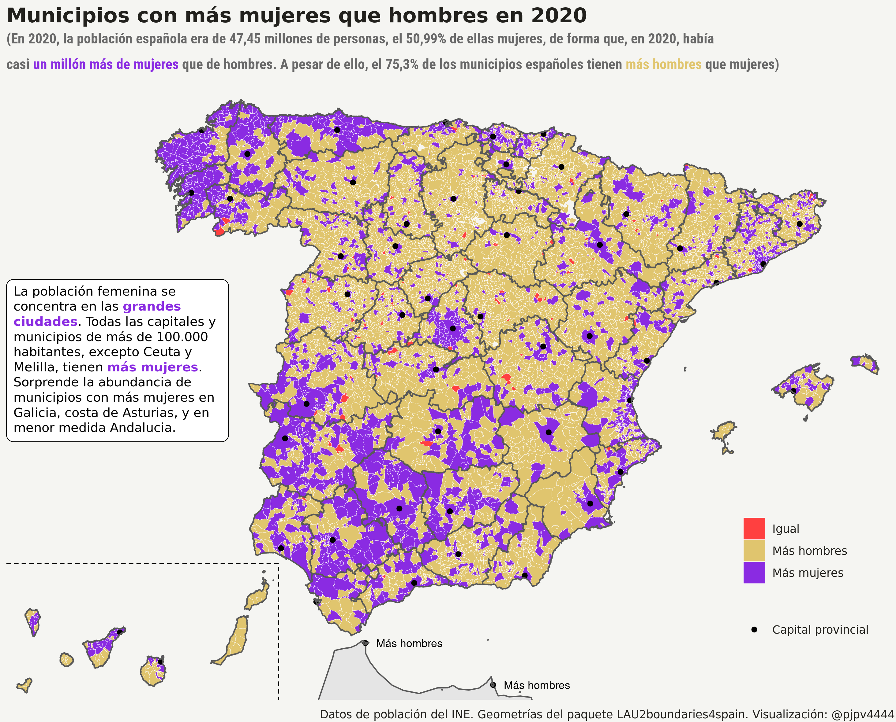

```{r setup, include=FALSE}
library(formatR)
knitr::opts_chunk$set(
  #code_folding = FALSE,
  echo = FALSE, warning = FALSE, message = FALSE,
  comment = "#>", results = "hold",
  collapse = TRUE,  fig.show = "hold", fig.asp = 0.618, fig.width = 6, out.width = "70%", fig.align = "center",
  R.options = list(width = 70) #- Keeping R code and output at 70 characters wide (or less) is recommended for readability on a variety of devices and screen sizes.
)
```

```{r options_setup, include = FALSE}
options(scipen = 999) #- para quitar la notación científica
```

```{r xaringanExtra-clipboard, include = FALSE}
htmltools::tagList(
  xaringanExtra::use_clipboard(
    button_text = "<i class=\"fa fa-clipboard\"></i>",
    success_text = "<i class=\"fa fa-check\" style=\"color: #90BE6D\"></i>",
  ),
  rmarkdown::html_dependency_font_awesome()
)
```

## Intro/motivación

La motivación principal es que quiero replicar uno de los ejercicios que hacemos en clase . Estoy ya cansado de los datos del Padrón pero quiero, ahora que lo  tengo fresco, arreglar un par de tablas que me faltan y hacer un par de ejercicios más para tenerlos disponibles el año que viene. Así que el post será corto, creo, porque en principio solo quiero arreglar los datos y mostrar algún resultado. 

## Datos

Para los datos de población por genero podría usar los datos que utilicé en el segundo post, pero ya que me pongo y como luego quiero ver que municipio es más cerrado, voy a procesar la tabla 1.5 del Padrón para municipios.^[Hablo de estas tablas en el [post número 5.](file:///home/pjpv/Escritorio/pjperez.web/docs/posts/2021-02-28-seguimos-con-el-padron-continuo/index.html)]

Los datos son fáciles de procesar pero aún así tienen su cosa porque el INE los prepara para que sean mostrados en tablas, no para que sean procesados para analizarlos. Por ejemplo, en los datos está la población por municipios pero también los totales, el nombre y el código de los municipios figuran en la misma columna/variable; además aparecen registros para municipios que ya no existen, por ejemplo Cercedo y Cotobade que en 2017 se unieron para formar Cerdedo-Cotobade.

```{r, eval = FALSE, echo = TRUE, code_folding = TRUE}
#- procesar tabla 1.5 del Padrón continuo para municipios
#- Población por sexo y relación con lugar de nacimiento
library(tidyverse)
library(fs)

qq_tabla <- "/33574.px"  
my_ruta <- paste0(here::here("datos_in", "ine_padron_continuo", "2020", "municipios"), qq_tabla)
df_orig <- pxR::read.px(my_ruta) %>% as.data.frame()

df <- df_orig %>% janitor::clean_names()
zz <- pjpv2020.01::pjp_f_valores_unicos(df, nn_pjp = 70)
names(df)
#- quito totales y arreglo otras cosas
df <- df %>% filter(municipios != "Total Nacional") 
df <- df %>% mutate(periodo = stringr::str_remove(periodo, "1 de enero de "))
df <- df %>% tidyr::separate(municipios, into = c("ine_muni", "ine_muni.n") , sep = " ", extra = "merge")
df <- df %>% 
  dplyr::rename(year = periodo) %>% 
  dplyr::rename(rel_nacimiento = relacion_entre_lugar_de_nacimiento_y_residencia) %>% 
  dplyr::rename(values = value) 

#- pongo la pob_total en una columna
df <- df %>% group_by(year, ine_muni, sexo) %>% 
  mutate(values_total = values[which(rel_nacimiento == "Total")]) %>%  
  mutate(values_percent = values/values_total * 100) %>% ungroup()

#- junto con pob para tener provincia etc....
pob_2000_2020 <- readr::read_rds("/home/pjpv/Escritorio/my_datos_2021/datos/INE/pob_mun/ine_pob_mun_1996_2020.rds") %>% 
  mutate(year =as.character(year)) %>% 
  filter(poblacion == "Total") %>% #- solo para q haya una row x ano y muni (es q hay 3 H, M y T)
  select(year, ine_muni, ine_prov, ine_prov.n, ine_ccaa, ine_ccaa.n, capital_prov, capital_ccaa)  
df <- inner_join(df, pob_2000_2020)   #- ahora si salen 8.131 (hay muni ya muertos Cotobade, Oza etc....)

#- #- cambiar las etiquetas de rel_nacimiento
nombres_vv <- unique(df$rel_nacimiento) #- cambiar las etiquetas de rel_nacimiento
df <- df %>% mutate(rel_nacimiento = case_when(
  rel_nacimiento == nombres_vv[1] ~ "Total",
  rel_nacimiento == nombres_vv[2] ~ "España",
  rel_nacimiento == nombres_vv[3] ~ "Misma CA",
  rel_nacimiento == nombres_vv[4] ~ "Misma provincia",
  rel_nacimiento == nombres_vv[5] ~ "Mismo municipio",
  rel_nacimiento == nombres_vv[6] ~ "Distinto municipio",
  rel_nacimiento == nombres_vv[7] ~ "Distinta provincia",
  rel_nacimiento == nombres_vv[8] ~ "Distinta CA",
  rel_nacimiento == nombres_vv[9] ~ "Extranjero"), .after = rel_nacimiento)

df <- df %>% group_by(ine_prov, year, sexo)  %>% 
  select(year, sexo, ine_muni, ine_muni.n, ine_prov.n, rel_nacimiento, values, values_total, values_percent, everything()) %>% 
  mutate(values_prov_total = sum(values_total[which(rel_nacimiento == "Total")] , na.rm = TRUE), .after = values_percent) %>%
  ungroup() %>% 
  group_by(ine_prov, rel_nacimiento, year, sexo) %>% 
  mutate(values_prov = sum(values, na.rm = TRUE), .after = values_percent) %>% ungroup() %>%
  mutate(values_prov_percent = values_prov/values_prov_total*100, .after = values_prov_total) %>% 
  group_by(year, sexo) %>% #- calcular el total de ESP
  mutate(values_ESP_total = sum(values[which(rel_nacimiento == "Total")], na.rm = TRUE), .after = values_prov_percent) %>% 
  ungroup() %>% 
  group_by(rel_nacimiento, year, sexo) %>% 
  mutate(values_ESP = sum(values, na.rm = TRUE), .after = values_prov_percent) %>% ungroup() %>% 
  mutate(values_ESP_percent = values_ESP/values_ESP_total*100, .after = values_ESP_total)  %>% 
  ungroup()

#- exporto df
# readr::write_csv(df, here::here("datos", "INE", "ine_padron_continuo", "tablas_muni", "tabla_5_relacion_muni.csv"))
```

Una vez procesados la tabla sólo tengo que decidir que graficar. En realidad lo tengo decidido hace bastante: crearé una variable discreta que señale a los municipios con más, menos o igual número de mujeres que de hombres

```{r, eval = TRUE, echo = TRUE, code_folding = TRUE}
library(tidyverse)
library(sf)
#- datos padrón continuo ------------------------
#- tabla 5: relacion con el municipio 
padron_tt_5 <- readr::read_csv("/home/pjpv/Escritorio/my_datos_2021/datos/INE/ine_padron_continuo/tablas_muni/tabla_5_relacion_muni.csv")
#- me concentro solo en 2020   y dejo solo rel_nacimiento =  Total
df <- padron_tt_5 %>% 
  filter(year == 2020) %>% 
  filter(rel_nacimiento == "Total") %>% 
  select(sexo, values,ine_muni, ine_muni.n, ine_prov.n, ine_prov,ine_ccaa, ine_ccaa.n, capital_prov, capital_ccaa) %>% 
  pivot_wider(names_from = sexo, values_from = values) %>% 
  mutate(mas_mujeres_percent = (Mujeres - Hombres)/Hombres*100 ) %>% 
  mutate(mas_mujeres = case_when(
    Mujeres - Hombres > 0L ~ "Más mujeres",
    Mujeres - Hombres == 0L ~ "Igual",
    Mujeres - Hombres < 0L ~ "Más hombres")) %>% 
  select(ine_muni, ine_muni.n, ine_prov.n, ine_prov, Mujeres, Hombres, Total, mas_mujeres_percent, mas_mujeres,ine_ccaa, ine_ccaa.n, capital_prov, capital_ccaa) 


#- en todas las capitales y en todos los munis de mas de 100.000 siempre hay mas mujeres
zz <- df %>% filter(capital_prov == "Sí")
zz <- df %>% filter(Total >= 50000)
zz <- df %>% filter(Total >= 50000)
zz <- df %>% filter(mas_mujeres == "Más hombres")
```


```{r, eval = TRUE, echo = FALSE}
library(gt)
 #- tabla
janitor::tabyl(df, mas_mujeres) %>% janitor::adorn_pct_formatting() %>% janitor::adorn_totals("row") %>% 
gt::gt() %>% tab_header(title = md("**Municipios con** igual, menor o **mayor número de mujeres** que de hombres")) %>% tab_source_note(md("Datos provenientes del Padrón Continuo del INE")) %>% cols_label(mas_mujeres = "", n = "nº de municipios", percent = "Porcentaje")

```


Una vez hecho esto solo queda repetir lo que hice en segundo post para mostrar los resultados:

```{r, echo = FALSE, layout = "l-page"}

```

Queda comentar minimamente el mapa. ¿Qué decir de él? No mucho, no soy sociólogo ni demógrafo^[Es posible que el blog pase a llamarse"No soy sociólogo ni demógrafo pero ..."], además ya digo que el blog es para aprender R; a pesar de todas estas excusas, tengo mis opiniones, pero son eso opiniones, además no demasiado reflexionadas. ¿Qué me sugiere el gráfico? Pues que no es casualidad que, a pesar de que hay casi un millón de mujeres más que de hombres, la mayoría de poblaciones pequeñas tengan más hombres que mujeres. Puede haber varias razones para que las mujeres "abandonen" las poblaciones pequeñas y tiendan a concentrase en las ciudades: igual tienen menos posibilidades laborales^[En los pueblos muy pequeños, la mayoría de trabajos están relacionados con la agricultura y ganadería, trabajos tradicionalmente vinculados a varones.] en las poblaciones pequeñas, o igual los condicionantes familiares y/o sociales hacen, o al menos hacían, que las mujeres las abandonasen.


Al final no he hecho la coropleta con escala bivariante. En el siguiente post.
