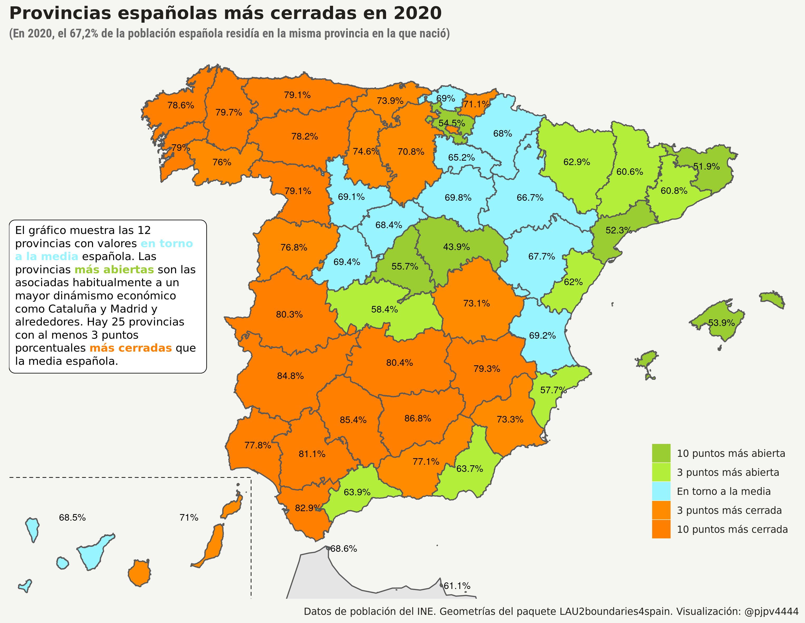

```{r setup, include=FALSE}
library(formatR)
knitr::opts_chunk$set(
  #code_folding = FALSE,
  echo = FALSE, warning = FALSE, message = FALSE,
  comment = "#>", results = "hold",
  collapse = TRUE,  fig.show = "hold", fig.asp = 0.618, fig.width = 6, out.width = "70%", fig.align = "center",
  R.options = list(width = 70) #- Keeping R code and output at 70 characters wide (or less) is recommended for readability on a variety of devices and screen sizes.
)
```

```{r options_setup, include = FALSE}
options(scipen = 999) #- para quitar la notación científica
```

```{r xaringanExtra-clipboard, include = FALSE}
htmltools::tagList(
  xaringanExtra::use_clipboard(
    button_text = "<i class=\"fa fa-clipboard\"></i>",
    success_text = "<i class=\"fa fa-check\" style=\"color: #90BE6D\"></i>",
  ),
  rmarkdown::html_dependency_font_awesome()
)
```

## Intro/motivación

La verdad es que tengo curiosidad por saber que provincia y municipio grande es más cerrado, en el sentido de que un mayor porcentaje de su población nació en la misma provincia y/o municipio. 

El término cerrado, al menos para mi, suele tener una connotación negativa, pero en este caso no podemos saber, al menos a ciencia cierta, porque la gente decide quedarse en el mismo municipio/provincia en la que nació. Una explicación podría ser que la gente no tiene la actitud y/o recursos económicos o personales para moverse, pero también puede ser porque la gente de ese lugar se encuentra tan a gusto que decide no moverse a pesar de que podría hacerlo. Ya sabéis que no soy sociólogo y, además, aún no sé que provincia/municipio es el más cerrado, así que dudo que lleguemos a obtener una explicación, pero al menos vamos a matar la curiosidad. Vamos a ello

Además pase lo que pase, tenga sentido o no, voy a hacer una "bivariate coropleta" con el paquete [biscale](https://github.com/slu-openGIS/biscale) y otro gráfico parecido con el paquete [tricolore](https://cran.r-project.org/web/packages/tricolore/vignettes/choropleth_maps_with_tricolore.html). Pero será rápido-rápido porque tengo otras cosas que hacer.


## Datos

Los datos viene del Padrón continuo del INE. Tanto los microdatos como algunas tablas del Padrón continuo tienen información sobre el municipio de residencia y el municipio de nacimiento, pero los microdatos blanquean mucha información para los municipios pequeños, así que usaré datos de las tablas que hay en la sección de resultados detallados para municipios, concretamente usaré los datos de la [tabla 1.5](https://www.ine.es/dynt3/inebase/index.htm?padre=6232&capsel=6233).

En función de la relación entre el municipio de residencia y el de nacimiento se pueden dar 6 situaciones: que la persona en cuestión resida en el mismo municipio en el que nació, que resida en distinto municipio pero en la misma provincia en la que nació, que resida en distinta provincia pero en la misma CA, que resida en una CA distinta a la del nacimiento o que haya nacido en el extranjero. Llamaremos a estas 6 situaciones: 1) Mismo municipio, 2) Misma provincia, 3) Misma CA, 4) Distinta CA, y 5) Extranjero.

En función de estas situaciones, podemos definir los municipios/provincias más cerrados como aquellos en los que un mayor porcentaje de su población reside en el mismo municipio/provincia de nacimiento.

Ya tengo arreglada y procesada la tabla 1.5 solo queda arreglar algo los datos para poder hacer las coropletas. La primera coropleta la haré para provincias y las probaturas con los paquetes `biscale` y `tricolore` lo haré con datos para municipios.

```{r, eval = FALSE, echo = TRUE, code_folding = TRUE}
library(tidyverse)
library(sf)
#- datos padrón continuo ------------------------
#- tabla 5: relacion con el municipio (Ya procesada)
padron_tt_5 <- readr::read_csv("/home/pjpv/Escritorio/my_datos_2021/datos/INE/ine_padron_continuo/tablas_muni/tabla_5_relacion_muni.csv")
#- me concentro solo en 2020  y en la poblacion Total
df <- padron_tt_5 %>% filter(year == 2020) %>% filter(sexo == "Total")  
#- selecciono una relación con el municipio: y me quedo con las PROVINCIAS
my_relacion <- "Misma provincia"   #-Mismo municipio"
df <- df %>% filter(rel_nacimiento == my_relacion) %>%  
  select(ine_prov, ine_prov.n, values_prov_percent, values_ESP_percent) %>% distinct()
#- creo valores para el label en el mapa
df <- df %>% mutate(values_prov_percent.l = paste0(round(values_prov_percent, digits = 1), "%"))
#- voy a discretizar el % de gente que vive een la misma provincia
aa_media <- mean(df$values_ESP_percent) #- media % vive en la misma prov para ESP
df <- df %>% 
  mutate(values_prov_percent.d = 
        cut(values_prov_percent, 
        breaks=c(-Inf, aa_media-10, aa_media-3, aa_media+3,  aa_media+10, Inf), 
        labels=c("10 puntos más abierto","3 puntos más abierto","En torno a la media", "3 puntos más cerrado", "10 puntos más cerrado")))
```


No lo voy a mostrar (voy rápido-rápido) pero Jaén (86,8%), Cordoba, Badajoz, Cadiz, Sevilla, Ciudad Real y Cáceres son provincias en las que más de un 80% de sus habitantes nacieron en la misma provincia, son las **provincias más cerradas**. Por contra, Guadalajara (43,9%), Girona, Tarragona, Illes Balears, Álava y Madrid (55,7%) son las **provincias más abiertas**, en el sentido de que el porcentaje de su población que nació en la provincia son menores. 


Ale, a gráficar, a ver si se muestra alguna pauta geográfica.

```{r, echo = FALSE, layout = "l-page"}

```

Pues sí, alguna pauta sale, pero hoy no voy a comentar nada que quiero hacer otros 2 gráficos y tengo poco más de media hora.

