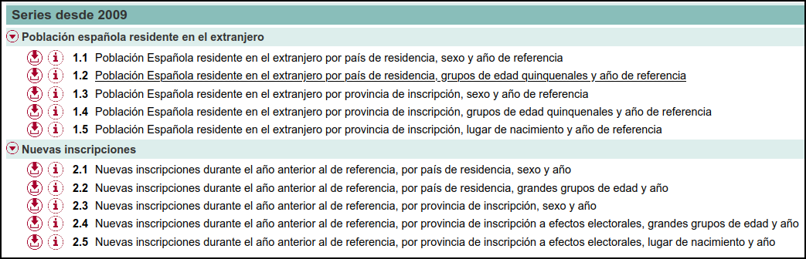
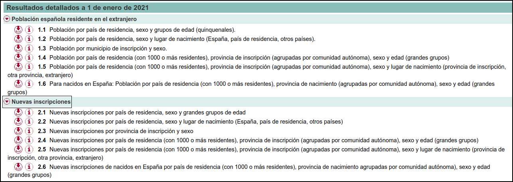

```{r setup, include=FALSE}
library(formatR)
knitr::opts_chunk$set(
  #code_folding = FALSE,
  echo = FALSE, warning = FALSE, message = FALSE,
  comment = "#>", results = "hold",
  collapse = TRUE,  fig.show = "hold", fig.asp = 0.618, fig.width = 6, out.width = "70%", fig.align = "center",
  R.options = list(width = 70) #- Keeping R code and output at 70 characters wide (or less) is recommended for readability on a variety of devices and screen sizes.
)
```

```{r options_setup, include = FALSE}
options(scipen = 999) #- para quitar la notación científica
```

```{r xaringanExtra-clipboard, include = FALSE}
htmltools::tagList(
  xaringanExtra::use_clipboard(
    button_text = "<i class=\"fa fa-clipboard\"></i>",
    success_text = "<i class=\"fa fa-check\" style=\"color: #90BE6D\"></i>",
  ),
  rmarkdown::html_dependency_font_awesome()
)
```

# Intro 🧙

El 18 de marzo el INE publicó los últimos datos del [**Padrón de Españoles Residentes en el Extranjero (PERE)**](https://ine.es/dyngs/INEbase/es/operacion.htm?c=Estadistica_C&cid=1254736177014&menu=ultiDatos&idp=1254734710990). Según la nota de prensa, a 1 de enero de 2021, el número de personas con nacionalidad española que residen en el extranjero llegó a 2.654.723 a 1 de enero de 2021. Esta cifra supone un incremento del 1,4% (36.131 personas) respecto a los datos a 1 de enero de 2020.  

Como puede leerse en la web del INE: el **PERE**  ofrece el recuento de la población de nacionalidad española residente habitualmente en el extranjero, a 1 de enero de cada año, por las siguientes variables de clasificación: país de residencia, sexo, edad, lugar de nacimiento y municipio de inscripción en España a efectos electorales.

El objetivo está claro, arreglar y jugar un poco con estos datos. Vamos que quiero saber cuantos youtubers hay en Andorra y de donde son 👤?

Además, el país donde más españoles hay es Argentina, intuyo que será gente mayor, asi que haré su pirámide de población.

El INE no ofrece microdatos sino que ofrece una serie de tablas:

1) Ofrece tablas resumen de resultados desde 2009. Concretamente ofrece las siguientes tablas:


```{r, layout="l-body-outset", echo = FALSE}

```

2) Tablas con resultados más detallados para cada año de 2009 hasta 2021. Concretamente:

```{r, layout="l-body-outset", echo = FALSE}

```


De todas ellas me apetece arreglar la **tabla	1.5**  de los resultados detallados para 2021. La tabla 5.1 proporciona: Población por país de residencia (con 1000 o más residentes), provincia de inscripción (agrupadas por comunidad autónoma), sexo y lugar de nacimiento (provincia de inscripción, otra provincia, extranjero). Con estos datos puedo ver en cada provincia a que pais del extranjero se van.

Con la tabla 1.3 podría ver que municipio tiene mas porcentaje de gente fuera

